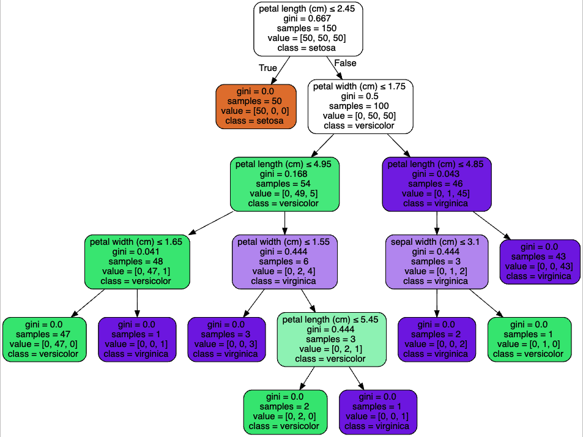
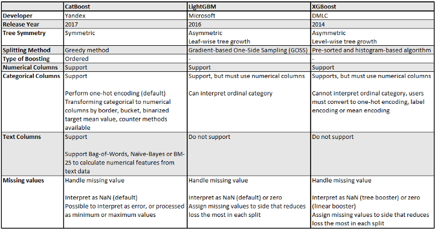

Trees
===

Decision Tree
---

### Visualization of tree

```python
from sklearn.datasets import load_iris
from sklearn import tree

iris = load_iris()
X, y = iris.data, iris.target
clf = tree.DecisionTreeClassifier()
clf = clf.fit(X, y)
```

```python
import graphviz
dot_data = tree.export_graphviz(
    decision_tree=clf,
    out_file=None,
    feature_names=iris.feature_names,
    class_names=iris.target_names,
    filled=True,
    rounded=True,
    special_characters=True,
)
graph = graphviz.Source(dot_data)
graph
```

{width=500}

Random Forest
---

> Bagging ensemble of decision trees

[Random Forest Algorithm Explained in Less Than 5 Minutes](https://medium.com/@techynilesh/random-forest-algorithm-explained-in-less-than-5-minutes-a433dc295f94)

XGBoost
---

LightGBM
---

[XGBoost vs LightGBM: How Are They Different - neptune.ai](https://neptune.ai/blog/xgboost-vs-lightgbm)



- [CatBoost vs. LightGBM vs. XGBoost](https://towardsdatascience.com/catboost-vs-lightgbm-vs-xgboost-c80f40662924)
- [XGBoost, Light GBM and CatBoost](https://medium.com/octave-john-keells-group/xgboost-light-gbm-and-catboost-a-comparison-of-decision-tree-algorithms-and-applications-to-a-f1d2d376d89c)