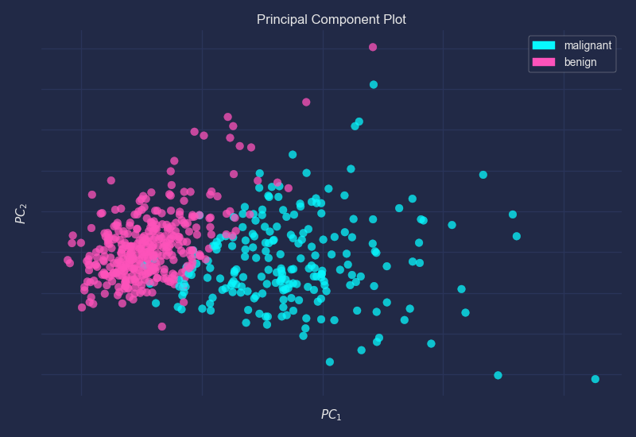
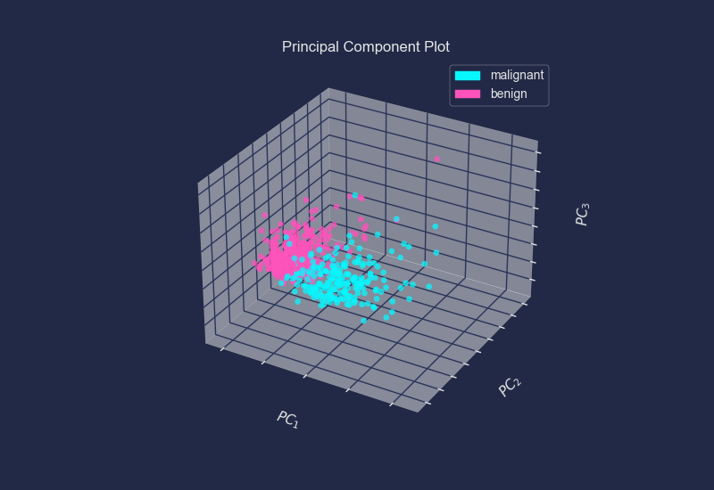
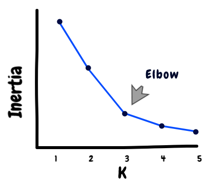
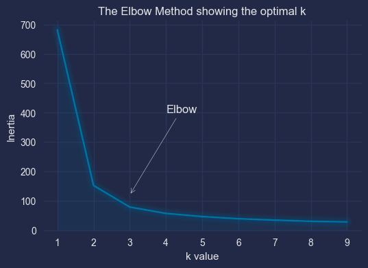
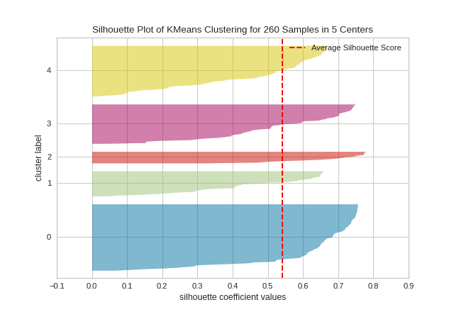
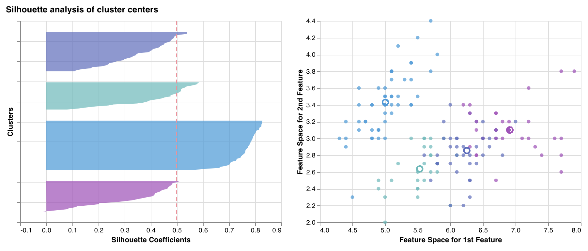

# Unsupervised Learning

## PCA

> Principal Component Analysis
>

### PCA Visualization

```python
import matplotlib.pyplot as plt
import mplcyberpunk
plt.style.use("cyberpunk")
```

Data preparation

```python
from sklearn.datasets import load_breast_cancer
cancer = load_breast_cancer()
classes = cancer.target_names
X = cancer.data
y = cancer.target
```

2D

```python
from yellowbrick.features import PCA
visualizer = PCA(scale=True, projection=2, classes=classes,)
visualizer.fit_transform(X, y)
visualizer.show()
```

{width=400}

3D

```python
visualizer = PCA(scale=True, projection=3, classes=classes,)
visualizer.fit_transform(X, y)
visualizer.show()
```

{width=400}

## K-MEANS

Reference

- [Medium: K-means Clustering: Algorithm, Applications, Evaluation Methods, and Drawbacks](https://towardsdatascience.com/k-means-clustering-algorithm-applications-evaluation-methods-and-drawbacks-aa03e644b48a)

Variants

| Variants           | API                                        | Reference                                                    |
| ------------------ | ------------------------------------------ | ------------------------------------------------------------ |
| K-Means            | `sklearn.cluster.KMeans`                   | [link](https://scikit-learn.org/stable/modules/generated/sklearn.cluster.KMeans.html) |
| K-Means++          | `sklearn.cluster.KMeans(init='k-means++')` |                                                              |
| Mini-batch K-Means | `sklearn.cluster.MiniBatchKMeans`          | [link](https://scikit-learn.org/stable/modules/generated/sklearn.cluster.MiniBatchKMeans.html) |

### Elbow method

{width=400}

==Inertia==: Intuitively, inertia tells how far away the points within a cluster are. Therefore, a small of inertia is aimed for. The range of inertia’s value starts from zero and goes up.

| Library          | API                                    | Reference                                                    |
| ---------------- | -------------------------------------- | ------------------------------------------------------------ |
| Yellowbrick      | `yellowbrick.cluster.KElbowVisualizer` | [link](https://www.scikit-yb.org/en/latest/api/cluster/elbow.html) |
| Weights & Biases | `wandb.sklearn.plot_elbow_curve`       | [link](https://docs.wandb.ai/guides/integrations/scikit#elbow-plot) |

{width=400}

#### Plot Function

```python
import pandas as pd
import numpy as np
import mplcyberpunk
import matplotlib.pyplot as plt
```

Data preparation

```python
from sklearn import datasets
iris = datasets.load_iris()
df = pd.DataFrame(iris['data'])
```

Elbow plot function [reference](https://predictivehacks.com/k-means-elbow-method-code-for-python/)

```python
from sklearn.cluster import KMeans

def kmeans_elbow_plot(data, arrow_head, arrow_tail, num=(1,10)):
    np.random.seed(42)
    distortions = []
    K = range(num[0], num[1])

    for k in K:
        kmeanModel = KMeans(n_clusters=k)
        kmeanModel.fit(data)
        distortions.append(kmeanModel.inertia_)
    
    plt.figure(figsize=(6,4))
    plt.plot(K, distortions, "bx-")
    plt.xlabel("k value")
    plt.ylabel("Inertia")
    plt.title("The Elbow Method showing the optimal k")
    plt.annotate(text='Elbow', xy=arrow_head, xytext=arrow_tail,
        arrowprops = dict(arrowstyle="->",color="white"))
    plt.style.use("cyberpunk")
    mplcyberpunk.add_glow_effects()
    plt.show()
```

```python
kmeans_elbow_plot(df, arrow_head=(3.0,120), arrow_tail=(4,400))
```

{width=400}

### Silhouette score

Measures & plots how close each point in one cluster is to points in the neighboring clusters. The thickness of the clusters corresponds to the cluster size. The vertical line represents the average silhouette score of all the points.

{width=400}

| Library          | API                                        | Reference                                                    |
| ---------------- | ------------------------------------------ | ------------------------------------------------------------ |
| Yellowbrick      | `yellowbrick.cluster.SilhouetteVisualizer` | [link](https://www.scikit-yb.org/en/latest/api/cluster/silhouette.html) |
| Weights & Biases | `wandb.sklearn.plot_silhouette`            | [link](https://docs.wandb.ai/guides/integrations/scikit#silhouette-plot) |

{width=600}